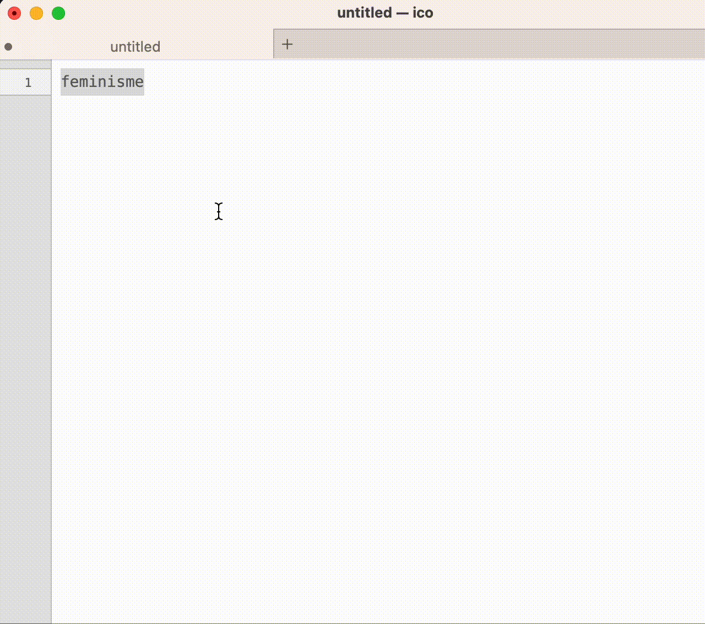

# Woordgeslacht

Deze voorziening zoekt bij een gegeven woord het lidwoord en bezittelijk voornaamwoord op in
de [Woordenlijst](https://www.woordenlijst.org).

Bijvoorbeeld: `applicatie` wordt `de applicatie en haar…`.

## Installatie

1. Download het .workflow-bestand
2. Dubbelklik op het gedownloade bestand.
3. De service is geïnstalleerd (waarschijnlijk in `~/Library/Services`)

## Gebruik

1. Selecteer een woord in bewerkbare tekst, in een willekeurig programma.
2. Rechter muisklik **Voorzieningen** > **Woordgeslacht**.

## Disclaimer

De service maakt gebruik van de publiekelijk beschikbare gegevens van Woordenlijst. 
Ik claim dan ook op geen enkele wijze eigenaarschap van deze gegevens. 
Alle lof voor Woordenlijst ✌️